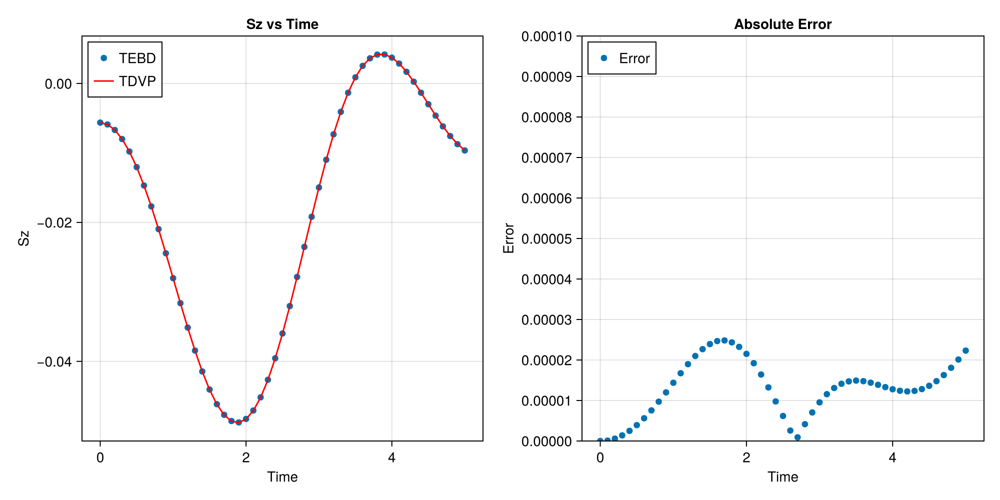

# Overview

这份代码由Julia语言编写，使用了ITensors，ITensorMPS库提供的张量收缩接口以及矩阵乘积态构造接口，实现了2-site Time Dependent Variational Principle这一时间演化算法。

**注意**：此工程中的TDVP算法并非是课程中所介绍的1-site TDVP算法，而是与2-site DMRG相似的2-site TDVP算法。2-TDVP相较于1-TDVP，拥有的优势是可以自适应地调整中间态的Bound Dimension大小，而不需要在运行之前手动设置一个较大的Bound Dimension值来保证结果的正确性。但这自然牺牲了算法的效率。

**Reference**: Paeckel, S., Köhler, T., Swoboda, A., Manmana, S. R., Schollwöck, U., & Hubig, C. (2019). Time-evolution methods for matrix-product states. Annals of Physics, 411, 167998.

# Run Code

为了运行这一代码，在当前文件夹下打开Julia REPL，按下键盘上的 ] 键进入Julia REPL的环境选择界面，并切换环境为当前路径下的Project.toml。

```Julia
(final project) pkg> activate .
```

随后，按下键盘上的 Backspace 键返回Julia REPL的解释界面，并输入以下代码以生成结果
```Julia
julia> include("main.jl")
```

当然，也可以直接在路径指向当前文件夹的命令行(bash, zsh, powershell..)中运行以下指令以计算结果

```cmd
$ julia --project=. main.jl
```

在运行完成后，当前路径下会出现 result.png 文件，展示了代码的结果

# Result

代码中利用TEBD及2site-TDVP算法分别计算了一维海森堡模型的时间演化。一维海森堡模型的哈密顿量如下

$$
H = \sum_{j=1}^{N-1} S^{z}_j S^z_{j+1} + \frac{1}{2}S^+_jS^-_{j+1} + \frac{1}{2}S^{-}_jS^{+}_{j+1}
$$

初态为交错排列的纯态，即
$$
|\psi_{init}\rang = |\uparrow\downarrow\uparrow\downarrow\uparrow\cdots\rang
$$

共$N=40$个自旋，单步演化时长为$\Delta t = 0.1$，总演化时长为 $T_{total} = 5.0$，SVD截断误差为$10^{-8}$。程序记录了每一步演化完成后位置在$\frac{N}{2}$位置的自旋$S_z$的期望值。


定义Error为$|S_{z,tebd}^{\frac{n}{2}} - S_{z, tdvp}^{\frac{n}{2}}|$。其中$S_{z, \text{algorithm}}^{\text{position}}$代表了运用的算法为algorithm，测量位置在position的$S_{z}$的期望值。从上图中可以看出，TDVP算法和TEBD算法的单步绝对误差均在$10^{-5}$量级，正确性显然。
测试中发现运行效率并没有TEBD高，这是自然的，因为TDVP算法每步需要收缩的张量个数远超TEBD算法。并且TDVP算法能够处理长程纠缠，但测试中计算的哈密顿量不含长程纠缠项，因此未看出TEBD与TDVP的算法正确性差别。

# Code Explanation

代码分为了三个部分，其中```main.jl```是用于运行TDVP和TEBD算法，并绘制结果对比图。而```tebd.jl```和```tdvp.jl```中则是TEBD和TDVP算法的具体实现。

## main.jl

```main```函数接受参数N(系统尺寸)，dt(单步演化时长)，Tmax(演化总时长)，cutoff(SVD截断误差)。并返回利用TEBD以及TDVP算法进行时间演化时，每一步演化后可观测量$S_z^{\frac{n}{2}}$的期望值。

```plot_result```函数用于展示两个算法的运行结果以及误差大小。

## tdvp.jl

```hamiltonian```函数接受一个整数N，返回一个大小为N的一维开放边界海森堡模型的哈密顿量以及初始态$|\psi_{init}\rangle=|\uparrow\downarrow\uparrow\downarrow\uparrow\cdots\rangle$

```applyH2``` 函数接受一个等待被有效哈密顿量$H_{eff}$张量AC，以及构造有效哈密顿量$H_{eff}$的张量lenv(左环境张量), M1(哈密顿量算符), M2(哈密顿量算符), renv(右环境张量)。返回被有效哈密顿量作用之后的结果张量$H_{eff} \times AC$

```applyH1``` 函数接受一个等待被有效哈密顿量$H_1$张量AC，以及构造有效哈密顿量$H_1$的张量lenv(左环境张量)和renv(右环境张量)。返回被有效哈密顿量作用之后的结果张量$H_1 \times AC$。

```updateleftenv``` 函数更新左环境张量。接受参数FL（先前的左环境张量），A（左正交化的投影MPS张量），以及M（哈密顿量操作符）。返回更新后的左环境张量。

```updaterightenv``` 函数更新右环境张量。接受参数FR（先前的右环境张量），A（右正交化的投影MPS张量），以及M（哈密顿量操作符）。返回更新后的右环境张量。

```show_maxdim``` 函数用于显示MPS的最大Bound Dimension。接受参数psi（MPS对象），遍历MPS的每个张量并计算最大维度，最终输出最大维度。

```tdvp2sweep``` 函数接受参数psi(态的MPS形式)，H(哈密顿量的MPO形式)，$\Delta t$(单步演化时长)以及cutoff(SVD截断误差)。这一函数执行了一个2-site的tdvp扫描变分过程。过程包含了从左到右的一次扫描，并对每个张量演化$\frac{\Delta t}{2}$的时间，以及从右往左的一次扫描，并对每个张量演化$\frac{\Delta t}{2}$的时间。

```ITensortdvpmain``` 函数使用了```ITensorTDVP.jl```中编写的TDVP算法来计算态的时间演化，我用这一算法来benchmark我写的代码的时间复杂度以及正确性

## tebd.jl

```tebdmain```函数是直接利用了TEBD算法来计算态的时间演化，我用这一算法来benchmark我写的TDVP算法的正确性。